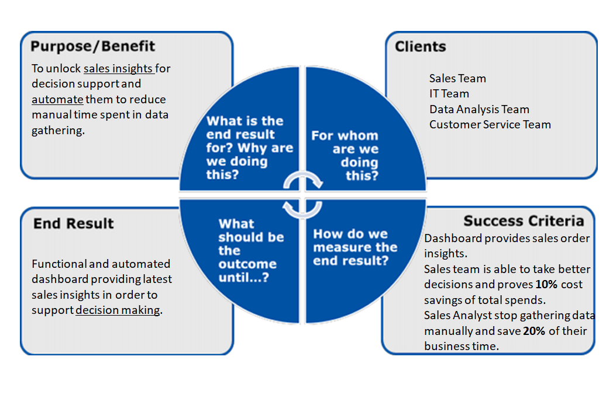

# Sales Insights :chart_with_upwards_trend:
Sales Insights for an Unnamed Company in India.

 

## Main Idea - Problem Statement
The company provides hardware to other firms and recently realized that their sales are decreasing. The manager asked the Data Analysis Team for Data Insights. Initially, they were looking to find:
- Revenue by cities
- Revenue by year
- Top 5 costumers by revenue
- Top 5 products by revenue

## Project Planning - Aims Grid

  

## Dataset
Database (MySQL) with five tables: customers, date, markets, products, transactions.
Data Cleaning and preprocessing:
- Removal of null values. For example, old companies that no longer take hardware from the Unnamed company.
- Removal of invalid values and filtering (e.g. >= 1 sales quantity etc.)
- Currency conversion ("USD" to "INR"). All prices need to be in Indian Rupee for proper insights.
## Sample SQL queries for Data Analysis

1. Show number of transactions performed in 2019  
`SELECT COUNT(*) FROM sales.transactions WHERE YEAR(order_date)="2019";`
2. Show transcations for Bengaluru market (market_code='Mark006')  
`SELECT * FROM transactions where market_code='Mark006';`
3. Show total revenue in 2020 (INR)  
`SELECT SUM(sales.transactions.sales_amount) 
FROM sales.transactions 
WHERE YEAR(order_date)="2020";`
4. Show number of distinct customers that made a transaction  
`SELECT COUNT(DISTINCT sales.customers.customer_code) AS "Number Of Customers" 
FROM sales.customers
		INNER JOIN sales.transactions 
                ON sales.customers.customer_code=sales.transactions.customer_code;`
5. Show customers with more than 20 million total INR on our tansactions  
`SELECT customers.customer_code,customers.custmer_name,sum(sales_amount) AS Price FROM sales.transactions
INNER JOIN customers ON transactions.customer_code=customers.customer_code
group by customer_code HAVING Price >20000000;`

Acknowledgments to @codebasics for providing the dataset and his idea.
